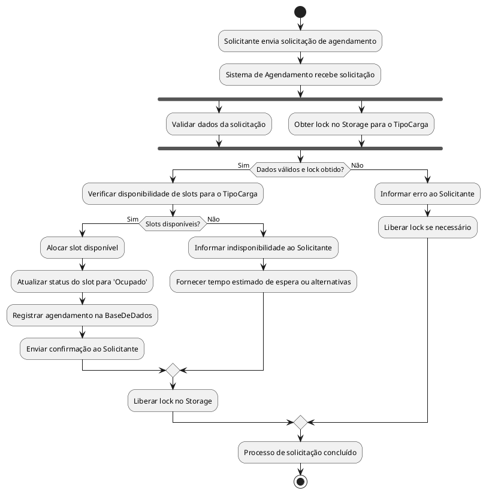
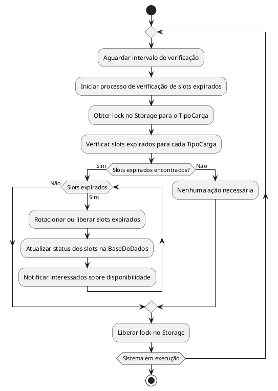

# Diagrama de Atividades 1: Processo de Solicitação de Agendamento

## Propósito

Este diagrama detalha o fluxo de atividades envolvido quando um solicitante realiza uma solicitação de agendamento, e como o sistema processa essa solicitação, incluindo validações, alocação de slots e comunicação com o solicitante.

## Diagrama em PlantUML

## Explicação do Diagrama

1. **Início do Processo**:
   - O **Solicitante** envia uma solicitação de agendamento, especificando o tipo de carga e a duração desejada.

2. **Recebimento e Validação**:
   - O **Sistema de Agendamento** recebe a solicitação.
   - Em paralelo:
     - **Valida os dados da solicitação** para garantir que estão corretos e completos.
     - **Obtém um lock no Storage** para o tipo de carga solicitado, garantindo acesso exclusivo durante a operação.

3. **Verificação de Condições**:
   - Se os dados são válidos **e** o lock foi obtido, o sistema prossegue; caso contrário, informa o erro ao solicitante e libera o lock se necessário.

4. **Verificação de Disponibilidade**:
   - O sistema verifica se há slots disponíveis para o tipo de carga solicitado.

5. **Alocação ou Indisponibilidade**:
   - **Se houver slots disponíveis**:
     - Aloca o slot disponível.
     - Atualiza o status do slot para 'Ocupado'.
     - Registra o agendamento na base de dados.
     - Envia uma confirmação ao solicitante.
   - **Se não houver slots disponíveis**:
     - Informa a indisponibilidade ao solicitante.
     - Fornece um tempo estimado de espera ou alternativas.

6. **Liberação do Lock**:
   - O sistema libera o lock no storage, permitindo que outros processos acessem os recursos.

7. **Conclusão**:
   - O processo de solicitação é concluído.

# Diagrama de Atividades 2: Processo de Rotação de Ocupação

## Propósito

Este diagrama ilustra o processo contínuo e assíncrono de verificação e rotação dos slots cuja ocupação expirou, garantindo que os slots sejam liberados e disponibilizados para novos agendamentos.

## Diagrama em PlantUML

## Explicação do Diagrama

1. **Início do Processo Assíncrono**:
   - O processo de rotação de ocupação inicia e é executado em loop enquanto o sistema estiver em operação.

2. **Aguardar Intervalo**:
   - O sistema aguarda um intervalo de tempo predefinido antes de iniciar a próxima verificação, garantindo que os recursos não sejam sobrecarregados.

3. **Início da Verificação**:
   - Inicia o processo de verificação dos slots cuja ocupação pode ter expirado.

4. **Obtenção do Lock**:
   - Obtém um lock no storage para cada tipo de carga, garantindo que a operação seja realizada sem interferências.

5. **Verificação de Slots Expirados**:
   - Verifica se há slots com tempo de ocupação expirado para cada tipo de carga.

6. **Rotação ou Liberação de Slots**:
   - **Se slots expirados forem encontrados**:
     - Rotaciona ou libera esses slots.
     - Atualiza o status dos slots na base de dados.
     - Notifica os solicitantes interessados sobre a nova disponibilidade.
   - **Se não houver slots expirados**:
     - Nenhuma ação adicional é necessária neste ciclo.

7. **Liberação do Lock**:
   - Libera o lock no storage, permitindo que outras operações possam acessar os slots.

8. **Continuação do Loop**:
   - O processo repete enquanto o sistema estiver em execução, assegurando que os slots sejam gerenciados adequadamente ao longo do tempo.

## Considerações Adicionais

- **Processos Separados**:
  - Dividir os diagramas melhora a legibilidade e facilita o entendimento de cada processo individualmente.

- **Concorrência e Sincronização**:
  - O uso de locks em ambos os processos é crucial para manter a integridade dos dados e evitar conflitos de acesso.

- **Processo Assíncrono**:
  - A rotação de ocupação é executada independentemente das solicitações dos usuários, mas interage com elas ao liberar slots e notificar os solicitantes.

- **Notificações**:
  - O sistema mantém os solicitantes informados sobre a disponibilidade de slots, melhorando a experiência do usuário e a eficiência do sistema.