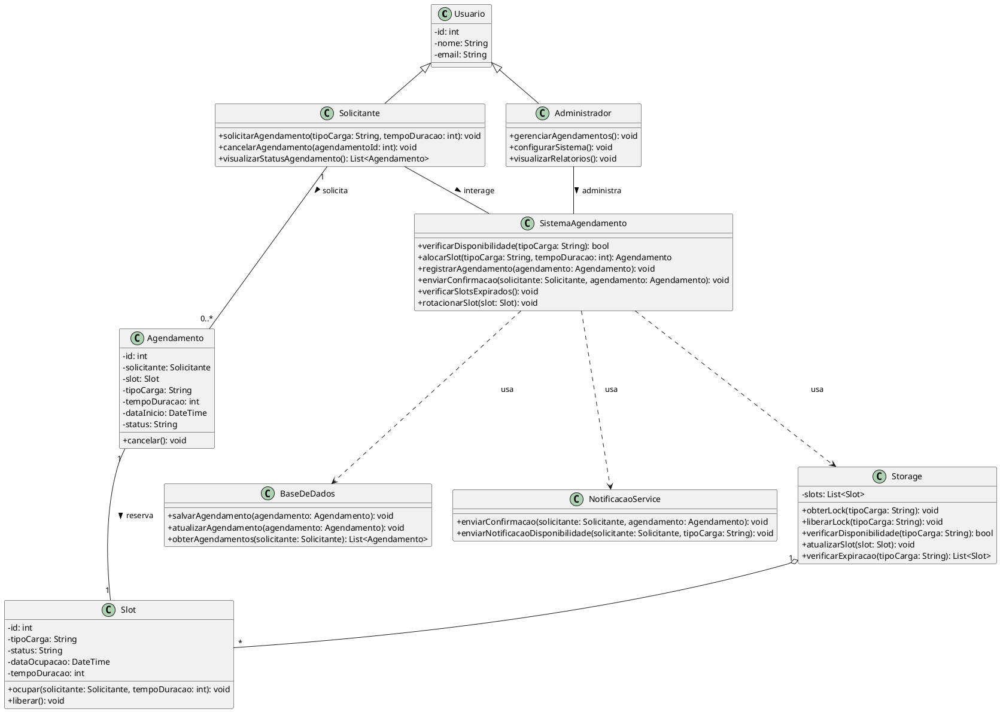

# Diagrama de Classes (Class Diagram)

## Propósito

O diagrama de classes modela a estrutura estática do sistema, representando as classes, seus atributos, métodos e os relacionamentos entre elas. Serve como base para o design orientado a objetos e a implementação do sistema.

## Diagrama em PlantUML

Segue o diagrama de classes representado em PlantUML:

## Explicação do Diagrama

### **Classes Principais**

1. **Usuario**
   - Classe base para **Solicitante** e **Administrador**.
   - **Atributos**:
     - `id`: Identificador único do usuário.
     - `nome`: Nome do usuário.
     - `email`: Contato para notificações.
   - **Relação de Herança**:
     - **Solicitante** e **Administrador** herdam de **Usuario**.

2. **Solicitante**
   - Representa o usuário que solicita agendamentos.
   - **Métodos**:
     - `solicitarAgendamento(tipoCarga, tempoDuracao)`: Inicia um novo agendamento.
     - `cancelarAgendamento(agendamentoId)`: Cancela um agendamento existente.
     - `visualizarStatusAgendamento()`: Consulta o status dos agendamentos.

3. **Administrador**
   - Representa o administrador do sistema.
   - **Métodos**:
     - `gerenciarAgendamentos()`: Visualiza e manipula agendamentos.
     - `configurarSistema()`: Altera configurações do sistema.
     - `visualizarRelatorios()`: Gera relatórios de uso e desempenho.

4. **SistemaAgendamento**
   - Classe central que coordena as operações de agendamento.
   - **Métodos**:
     - `verificarDisponibilidade(tipoCarga)`: Checa a disponibilidade de slots.
     - `alocarSlot(tipoCarga, tempoDuracao)`: Aloca um slot disponível.
     - `registrarAgendamento(agendamento)`: Salva o agendamento.
     - `enviarConfirmacao(solicitante, agendamento)`: Notifica o solicitante.
     - `verificarSlotsExpirados()`: Monitora e trata slots expirados.
     - `rotacionarSlot(slot)`: Libera ou rotaciona um slot.

5. **Agendamento**
   - Representa um agendamento feito pelo solicitante.
   - **Atributos**:
     - `id`, `solicitante`, `slot`, `tipoCarga`, `tempoDuracao`, `dataInicio`, `status`.
   - **Métodos**:
     - `cancelar()`: Cancela o agendamento.

6. **Slot**
   - Representa um espaço disponível no storage.
   - **Atributos**:
     - `id`, `tipoCarga`, `status`, `dataOcupacao`, `tempoDuracao`.
   - **Métodos**:
     - `ocupar(solicitante, tempoDuracao)`: Reserva o slot.
     - `liberar()`: Disponibiliza o slot.

7. **Storage**
   - Gerencia os slots e controla a concorrência.
   - **Atributos**:
     - `slots`: Lista de todos os slots.
   - **Métodos**:
     - `obterLock(tipoCarga)`: Garante acesso exclusivo.
     - `liberarLock(tipoCarga)`: Libera o acesso.
     - `verificarDisponibilidade(tipoCarga)`: Verifica slots livres.
     - `atualizarSlot(slot)`: Atualiza o status de um slot.
     - `verificarExpiracao(tipoCarga)`: Identifica slots expirados.

8. **BaseDeDados**
   - Responsável pela persistência dos dados.
   - **Métodos**:
     - `salvarAgendamento(agendamento)`.
     - `atualizarAgendamento(agendamento)`.
     - `obterAgendamentos(solicitante)`.

9. **NotificacaoService**
   - Gerencia o envio de notificações.
   - **Métodos**:
     - `enviarConfirmacao(solicitante, agendamento)`.
     - `enviarNotificacaoDisponibilidade(solicitante, tipoCarga)`.

### **Relacionamentos**

- **Herança**:
  - **Solicitante** e **Administrador** herdam de **Usuario**.

- **Associações**:
  - **Solicitante** solicita múltiplos **Agendamentos**.
  - **Agendamento** reserva um **Slot**.
  - **Storage** compõe vários **Slots**.

- **Dependências**:
  - **SistemaAgendamento** usa **Storage**, **BaseDeDados** e **NotificacaoService** para executar suas funções.

- **Interações com Atores**:
  - **Solicitante** e **Administrador** interagem com o **SistemaAgendamento** para realizar suas atividades.

### **Notas Adicionais**

- **Encapsulamento e Visibilidade**:
  - Atributos privados (`-`) e métodos públicos (`+`) mantêm o encapsulamento das classes.

- **Tipos de Dados e Retornos**:
  - Métodos especificam tipos de parâmetros e retornos para maior clareza.

- **Tratamento de Concorrência**:
  - O **Storage** utiliza métodos para controlar locks, garantindo acesso exclusivo durante operações críticas.

- **Persistência**:
  - **BaseDeDados** abstrai o acesso aos dados persistentes, podendo ser implementada com diferentes tecnologias.

- **Serviços Externos**:
  - **NotificacaoService** pode ser um serviço externo ou interno que lida com comunicações assíncronas.

## Considerações Finais

O diagrama de classes oferece uma visão detalhada da estrutura do sistema, facilitando o entendimento das entidades envolvidas e suas interações. Este modelo é essencial para orientar o desenvolvimento e assegurar que todos os requisitos funcionais e não funcionais sejam atendidos.

**Próximos Passos**:

- **Validação Técnica**: Revisar o diagrama com a equipe técnica para ajustar detalhes e garantir aderência aos padrões adotados.

- **Especificação de Detalhes**: Para cada classe, detalhar as implementações dos métodos, considerando possíveis exceções e casos especiais.

- **Integração com Outros Diagramas**: Utilizar este diagrama como base para desenvolver diagramas de sequência, atividades e estados, aprofundando o design do sistema.