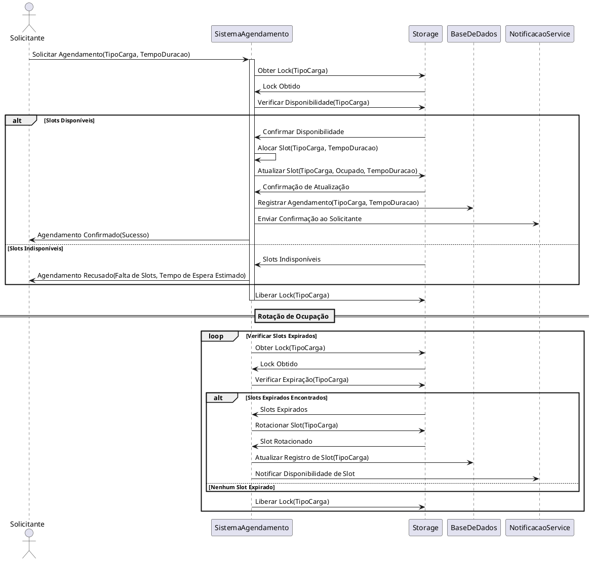

# Cenário Descrito

1. **Ator**: Um ator (usuário ou sistema externo) inicia o processo solicitando um agendamento de ocupação para um tipo específico de carga, especificando a duração desejada.

2. **Sistema de Agendamento**: Recebe a solicitação, valida as capacidades e tipos de slots disponíveis e utiliza mecanismos de sincronização (como locks) para gerenciar o acesso concorrente aos recursos.

3. **Storage**: Cada armazenamento possui uma capacidade total e é dividido em slots de tipos variados. O sistema de agendamento obtém um lock no storage para o tipo de carga solicitado, verifica a disponibilidade dos slots e agenda a ocupação se possível.

4. **Concorrência**: O sistema gerencia solicitações concorrentes utilizando locks para evitar condições de corrida. Em caso de concorrência, o sistema pode resolver conflitos baseando-se em prioridades ou colocando as solicitações em uma fila de espera, garantindo que a capacidade do storage não seja ultrapassada.

5. **Feedback Detalhado ao Solicitante**: O sistema retorna ao solicitante uma confirmação detalhada do agendamento. Se o agendamento for recusado devido à falta de slots disponíveis, o sistema fornece informações adicionais, como o tempo estimado de espera ou alternativas disponíveis.

6. **Atividades Internas do Sistema**:
   - **Registro do Agendamento**: O sistema registra o agendamento na base de dados para manter um histórico e facilitar a gestão futura.
   - **Notificações**: O sistema utiliza um serviço de notificações para enviar confirmações ou atualizações ao solicitante sobre o status do agendamento.
   - **Atualização de Registros durante a Rotação**: Durante a rotação de ocupação, o sistema atualiza os registros na base de dados para refletir a liberação dos slots e pode notificar os interessados sobre a disponibilidade dos slots liberados.

7. **Rotação de Ocupação**: As ocupações têm um tempo de duração definido. Um processo assíncrono no sistema de agendamento verifica periodicamente os slots para identificar aqueles cuja ocupação expirou. O sistema obtém um lock no storage para evitar conflitos durante a rotação. Quando um slot expirado é encontrado, o sistema rotaciona ou libera o slot, permitindo que novas alocações sejam feitas.

8. **Escalabilidade e Extensibilidade**: O sistema suporta múltiplos tipos de carga com regras e capacidades diferentes. Ao verificar a disponibilidade, o sistema considera as características específicas do tipo de carga solicitado.

## Diagrama de Sequência em PlantUML

## Explicação do Diagrama

1. **Solicitação de Agendamento**:
   - O ator inicia o processo solicitando um agendamento para um tipo específico de carga, especificando a duração desejada.

2. **Obtenção de Lock e Verificação de Disponibilidade**:
   - O **Sistema de Agendamento** obtém um lock no **Storage** para o tipo de carga solicitado, gerenciando a concorrência e evitando condições de corrida.
   - Com o lock obtido, o sistema consulta o storage para verificar se há slots disponíveis para o tipo de carga solicitado.

3. **Alocação e Gerenciamento de Concorrência**:
   - **Slots Disponíveis**:
     - Se slots estiverem disponíveis, o sistema aloca o slot e atualiza o status no storage.
     - Registra o agendamento na base de dados para manter um histórico e facilitar a gestão futura.
     - Envia uma confirmação ao solicitante através do serviço de notificações.
     - Libera o lock no storage após a conclusão do processo.
   - **Slots Indisponíveis**:
     - Se não houver slots disponíveis, o sistema informa o solicitante e pode fornecer um tempo estimado de espera ou alternativas.
     - Libera o lock no storage após informar o solicitante.

4. **Confirmação e Notificação ao Solicitante**:
   - O sistema retorna ao solicitante uma confirmação detalhada do agendamento ou informações sobre a indisponibilidade.
   - Utiliza o serviço de notificações para enviar atualizações sobre o status do agendamento.

5. **Rotação de Ocupação**:
   - Um processo assíncrono (loop) no sistema de agendamento verifica periodicamente os slots para identificar aqueles cuja ocupação expirou.
   - O sistema obtém um lock no storage para o tipo de carga antes de modificar o status dos slots, garantindo consistência e evitando conflitos com outros processos.
   - **Slots Expirados Encontrados**:
     - Rotaciona ou libera o slot, permitindo que novas alocações sejam feitas.
     - Atualiza os registros na base de dados para refletir a liberação dos slots.
     - Notifica os interessados sobre a disponibilidade dos slots liberados.
     - Libera o lock no storage após a conclusão do processo.
   - **Nenhum Slot Expirado**:
     - Se nenhum slot expirado for encontrado, o sistema libera o lock e continua a verificação em intervalos regulares.

6. **Atividades Internas do Sistema**:
   - **Registro do Agendamento**:
     - Registra detalhes do agendamento na base de dados, incluindo o tipo de carga, duração e informações do solicitante.
   - **Atualização de Registros durante a Rotação**:
     - Atualiza a base de dados para refletir a liberação e disponibilidade dos slots após a rotação.
   - **Notificações**:
     - Envia confirmações, lembretes e atualizações sobre o status do agendamento ao solicitante.
     - Notifica interessados sobre a disponibilidade de slots após a rotação.

7. **Escalabilidade e Extensibilidade**:
   - Suporta múltiplos tipos de carga com regras e capacidades diferentes.
   - Ao verificar a disponibilidade, considera as características específicas do tipo de carga solicitado, garantindo que as regras de negócios sejam respeitadas.