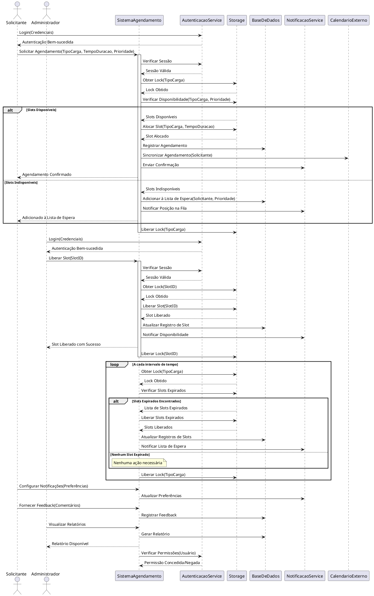

# Diagrama de Sequência Atualizado

## Propósito

O objetivo deste documento é apresentar um diagrama de sequência atualizado que incorpora todas as melhorias realizadas nos casos de uso do sistema de agendamento. O diagrama detalha as interações entre os atores e os componentes do sistema, refletindo funcionalidades como autenticação, gerenciamento de prioridades, lista de espera, liberação direta de slots pelo administrador, integração com serviços externos, concorrência, paralelismo e estratégias de alocação. A intenção é fornecer uma visão clara e estruturada de como o sistema opera, garantindo funcionalidade, confiabilidade, resiliência e observabilidade.

## Diagrama de Sequência em PlantUML

## Explicação do Diagrama

### **Atores**

- **Solicitante**: Usuário que deseja realizar e gerenciar agendamentos.
- **Administrador**: Usuário com privilégios para gerenciar o sistema, incluindo a liberação direta de slots e a visualização de relatórios.

### **Componentes do Sistema**

- **SistemaAgendamento**: Serviço central que coordena as operações de agendamento.
- **AutenticacaoService**: Responsável pela autenticação e autorização dos usuários.
- **Storage**: Gerencia os slots disponíveis para agendamento.
- **BaseDeDados**: Armazena dados persistentes, como agendamentos, usuários e feedback.
- **NotificacaoService**: Envia notificações aos usuários através de vários canais.
- **CalendarioExterno**: Integração com serviços de calendário para sincronização de agendamentos.

### **Casos de Uso para os Atores**

#### **Solicitante**

1. **Autenticar-se no Sistema**
   - Realiza login utilizando credenciais válidas.
   - O sistema autentica o usuário e estabelece uma sessão segura.

2. **Solicitar Agendamento**
   - Envia uma solicitação especificando tipo de carga, duração e prioridade.
   - O sistema verifica disponibilidade e aloca o slot ou adiciona o solicitante à lista de espera.
   - Recebe confirmação do agendamento ou posição na lista de espera.

3. **Configurar Notificações**
   - Define preferências para recebimento de notificações (email, SMS, push).

4. **Fornecer Feedback**
   - Envia comentários ou sugestões sobre o sistema ou agendamentos específicos.

#### **Administrador**

1. **Autenticar-se no Sistema**
   - Realiza login com credenciais administrativas.
   - O sistema autentica o administrador e estabelece uma sessão segura.

2. **Liberar Slot Diretamente**
   - Libera slots específicos, mesmo que estejam ocupados.
   - Ação notifica automaticamente os solicitantes na lista de espera.

3. **Visualizar Relatórios**
   - Acessa relatórios detalhados sobre o desempenho do sistema, utilização de slots e outros indicadores.

### **Relações**

- **Associações**:
  - **Solicitante** e **Administrador** interagem com o **SistemaAgendamento** para realizar suas respectivas operações.
  - **SistemaAgendamento** interage com componentes como **AutenticacaoService**, **Storage**, **BaseDeDados**, **NotificacaoService** e **CalendarioExterno** para executar as funcionalidades.

- **Dependências**:
  - **SistemaAgendamento** depende do **AutenticacaoService** para autenticação e autorização.
  - **SistemaAgendamento** utiliza o **Storage** para gerenciar disponibilidade de slots.
  - **SistemaAgendamento** interage com o **BaseDeDados** para persistência de informações.
  - **NotificacaoService** é utilizado para enviar comunicações aos usuários.
  - **CalendarioExterno** é integrado para sincronização de agendamentos.

### **Notas Adicionais**

- **Concorrência e Locks**:
  - Locks são utilizados ao interagir com o **Storage** para evitar condições de corrida e garantir a consistência dos dados em operações concorrentes.

- **Gerenciamento de Prioridades**:
  - Solicitações de agendamento consideram a prioridade do solicitante ao verificar disponibilidade e ao adicionar à lista de espera.

- **Rotação de Ocupação**:
  - Processo automatizado que verifica periodicamente slots expirados, libera-os e notifica os solicitantes na lista de espera.

- **Integração com Serviços Externos**:
  - **CalendarioExterno**: Permite aos solicitantes sincronizar agendamentos com seus calendários pessoais.
  - **NotificacaoService**: Suporta múltiplos canais de comunicação para manter os usuários informados.

- **Segurança e Conformidade**:
  - O sistema realiza verificações de permissão antes de executar operações sensíveis.
  - Todas as transações são realizadas de forma segura e em conformidade com regulamentações como a LGPD.

- **Observabilidade**:
  - Logs detalhados e monitoramento ativo permitem que os administradores acompanhem o desempenho e identifiquem possíveis problemas.

## Considerações Finais

O diagrama de sequência apresenta uma visão abrangente das interações entre os atores e os componentes do sistema, refletindo as melhorias incorporadas nos casos de uso. Ele destaca como o sistema lida com autenticação, gerenciamento de prioridades, lista de espera, liberação de slots, integração com serviços externos e outras funcionalidades críticas para o funcionamento eficiente e confiável do sistema de agendamento.

**Próximos Passos**:

1. **Especificação Detalhada dos Casos de Uso**:
   - Elaborar documentos detalhados para cada caso de uso, incluindo fluxos principais, alternativos e de exceção.

2. **Desenvolvimento de Diagramas Complementares**:
   - **Diagrama de Atividades**: Para visualizar processos complexos e fluxos de trabalho.
   - **Diagrama de Estados**: Para compreender o ciclo de vida dos slots e agendamentos.

3. **Validação com Stakeholders**:
   - Revisar o diagrama e as especificações com as partes interessadas para garantir que todos os requisitos estão sendo atendidos.

4. **Planejamento de Implementação**:
   - Definir prioridades para o desenvolvimento das funcionalidades.
   - Estabelecer um cronograma realista para a implementação.

5. **Testes e Qualidade**:
   - Planejar e executar testes unitários, de integração e de carga para assegurar a qualidade do sistema.

6. **Monitoramento e Observabilidade**:
   - Implementar ferramentas de monitoramento para acompanhar o desempenho do sistema em tempo real.

7. **Documentação e Treinamento**:
   - Desenvolver materiais de treinamento para usuários e administradores.
   - Manter a documentação atualizada para facilitar a manutenção e futuras expansões.