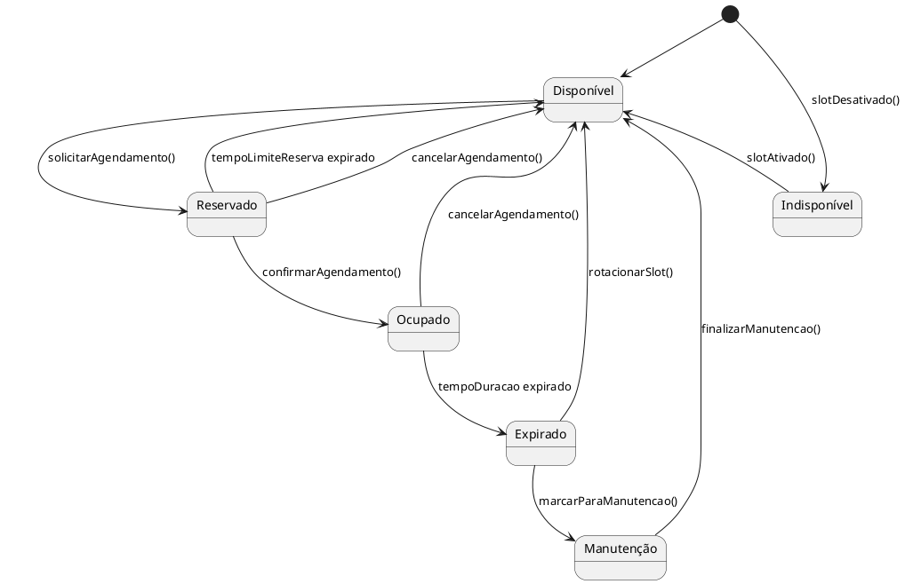

# Diagrama de Máquina de Estados (State Machine Diagram)

## Propósito

O diagrama de máquina de estados modela os diferentes estados pelos quais um objeto passa durante seu ciclo de vida e as transições entre esses estados causadas por eventos. No contexto do sistema de agendamento, vamos focar nos estados de um **Slot**, pois ele é um elemento central que muda de estado conforme é utilizado no sistema.

## Diagrama em PlantUML

Segue o diagrama de máquina de estados para a classe **Slot** representado em PlantUML:

## Explicação do Diagrama

### **Estados do Slot**

1. **Disponível**
   - O estado inicial padrão do slot.
   - O slot está livre e pode ser solicitado para agendamento.
   - **Transições**:
     - **Para Reservado**: Quando um solicitante inicia um agendamento (`solicitarAgendamento()`).

2. **Reservado**
   - O slot foi reservado por um solicitante.
   - Aguardando confirmação final do agendamento, como pagamento ou validação adicional.
   - **Transições**:
     - **Para Ocupado**: Após a confirmação do agendamento (`confirmarAgendamento()`).
     - **Para Disponível**: Se o tempo limite de reserva expirar (`tempoLimiteReserva expirado`) ou o solicitante cancelar o agendamento (`cancelarAgendamento()`).

3. **Ocupado**
   - O slot está atualmente em uso pelo solicitante.
   - **Transições**:
     - **Para Expirado**: Quando o tempo de ocupação expira (`tempoDuracao expirado`).
     - **Para Liberado**: Se o solicitante cancela o agendamento antes do término (`cancelarAgendamento()`).

4. **Expirado**
   - O tempo de ocupação do slot expirou.
   - O slot está aguardando rotacionamento ou ações de manutenção.
   - **Transições**:
     - **Para Disponível**: Após o processo de rotação (`rotacionarSlot()`).
     - **Para Manutenção**: Se o slot precisa ser marcado para manutenção (`marcarParaManutencao()`).

5. **Manutenção**
   - O slot está indisponível devido a manutenção, limpeza ou outros procedimentos.
   - **Transições**:
     - **Para Disponível**: Após a finalização da manutenção (`finalizarManutencao()`).

6. **Liberado**
   - Estado transitório onde o slot foi liberado antes do tempo de expiração.
   - Pode ser tratado como retorno imediato ao estado **Disponível**, dependendo da implementação.

7. **Indisponível**
   - O slot está desativado e não pode ser utilizado por nenhum solicitante.
   - **Transições**:
     - **Para Disponível**: Quando o slot é ativado novamente (`slotAtivado()`).

### **Transições e Eventos**

- **solicitarAgendamento()**
  - Evento disparado quando um solicitante inicia o processo de agendamento.
  - Transição de **Disponível** para **Reservado**.

- **confirmarAgendamento()**
  - Confirmação final do agendamento, possivelmente após validações adicionais.
  - Transição de **Reservado** para **Ocupado**.

- **tempoDuracao expirado**
  - Evento temporal indicando que o tempo de ocupação definido chegou ao fim.
  - Transição de **Ocupado** para **Expirado**.

- **rotacionarSlot()**
  - Ação de rotacionar ou liberar o slot após a expiração.
  - Transição de **Expirado** para **Disponível**.

- **cancelarAgendamento()**
  - Evento disparado quando o solicitante decide cancelar o agendamento.
  - Pode ocorrer em **Reservado** ou **Ocupado**, levando a diferentes estados.

- **tempoLimiteReserva expirado**
  - Indica que o tempo máximo para confirmar a reserva foi ultrapassado.
  - Transição de **Reservado** para **Disponível**.

- **marcarParaManutencao()**
  - Ação de colocar o slot em manutenção, talvez devido a um problema detectado.
  - Transição de **Expirado** para **Manutenção**.

- **finalizarManutencao()**
  - Conclusão das atividades de manutenção.
  - Transição de **Manutenção** para **Disponível**.

- **slotDesativado()**
  - Evento que desativa o slot, tornando-o indisponível para uso.
  - Transição de qualquer estado para **Indisponível**.

- **slotAtivado()**
  - Evento que reativa o slot desativado.
  - Transição de **Indisponível** para **Disponível**.

### **Notas de Estado**

- **Disponível**
  - **Descrição**: O slot está pronto para ser reservado por qualquer solicitante.
  - **Ação Possível**: Pode ser reservado.

- **Reservado**
  - **Descrição**: O slot foi reservado e está temporariamente indisponível para outros solicitantes.
  - **Ações Possíveis**: Confirmar agendamento ou cancelar reserva.

- **Ocupado**
  - **Descrição**: O slot está em uso ativo pelo solicitante.
  - **Ações Possíveis**: Aguardar expiração ou cancelar agendamento.

- **Expirado**
  - **Descrição**: O uso do slot foi finalizado, mas ainda não foi preparado para o próximo uso.
  - **Ações Possíveis**: Rotacionar slot ou enviar para manutenção.

- **Manutenção**
  - **Descrição**: O slot está sendo submetido a procedimentos de manutenção.
  - **Ações Possíveis**: Finalizar manutenção.

- **Indisponível**
  - **Descrição**: O slot está desativado e não participa do processo de agendamento.
  - **Ações Possíveis**: Ativar slot.

## Considerações Adicionais

- **Gerenciamento de Estados Críticos**
  - O estado **Indisponível** permite que administradores desativem slots por razões operacionais, como falhas ou necessidades estratégicas.
  - A transição para **Manutenção** após a expiração permite a integração de processos de manutenção preventiva ou corretiva.

- **Eventos Temporais**
  - Eventos como `tempoDuracao expirado` e `tempoLimiteReserva expirado` são desencadeados por contadores ou timers no sistema.
  - É importante que o sistema tenha um mecanismo confiável para monitorar esses eventos temporais.

- **Cancelamento de Agendamento**
  - O cancelamento pode ocorrer tanto no estado **Reservado** quanto em **Ocupado**, mas pode ter implicações diferentes (por exemplo, políticas de reembolso ou penalidades).

- **Flexibilidade do Modelo**
  - O modelo pode ser expandido ou adaptado conforme as necessidades específicas do negócio, como adicionar estados para processamento, limpeza, inspeção, etc.

- **Integridade dos Dados**
  - Transições entre estados devem ser atômicas para evitar condições de corrida, especialmente em ambientes com alta concorrência.

## Próximos Passos

- **Implementação das Regras de Negócio**
  - Definir detalhadamente as regras associadas a cada transição, incluindo validações e ações necessárias.

- **Integração com Outros Componentes**
  - Garantir que os outros componentes do sistema (como **SistemaAgendamento**, **Storage** e **BaseDeDados**) estejam alinhados com o modelo de estados do **Slot**.

- **Testes de Estado**
  - Desenvolver casos de teste para validar todas as transições e garantir que o **Slot** se comporte conforme esperado em diferentes cenários.

- **Documentação para Equipe de Desenvolvimento**
  - Fornecer este diagrama e explicações para a equipe de desenvolvimento para assegurar uma implementação consistente e correta.