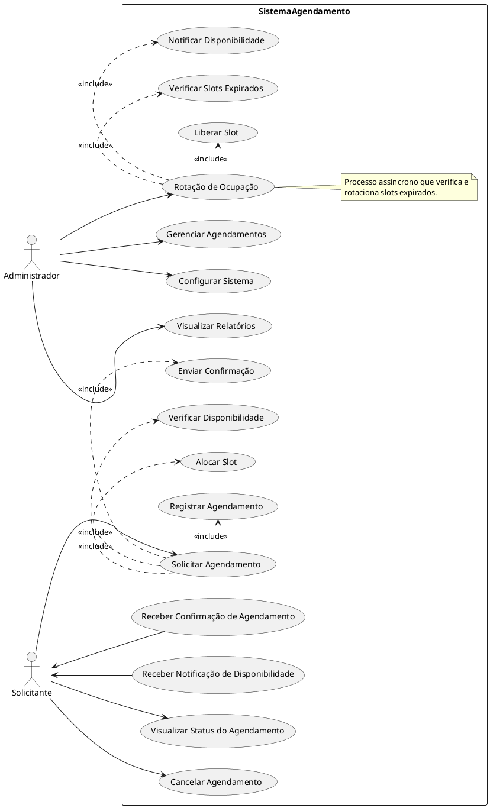

# Diagrama de Casos de Uso (Use Case Diagram)

## Propósito

O diagrama de casos de uso tem como objetivo representar graficamente as interações entre os atores (usuários ou sistemas externos) e o sistema de agendamento. Ele ilustra as funcionalidades que o sistema oferece e como os atores interagem com essas funcionalidades.

## Diagrama em PlantUML

Abaixo está o diagrama de casos de uso representado em PlantUML:

## Explicação do Diagrama

### **Atores Principais**

- **Solicitante**: Usuário ou sistema externo que solicita agendamentos e interage com o sistema para gerenciar seus agendamentos.
- **Administrador**: Responsável pela gestão do sistema, configurações, e monitoramento das operações.

### **Casos de Uso para o Solicitante**

1. **Solicitar Agendamento**:
   - O solicitante inicia um pedido de agendamento para um tipo específico de carga, especificando a duração desejada.
   - **Includes**:
     - **Verificar Disponibilidade**: O sistema verifica se há slots disponíveis para o tipo de carga solicitado.
     - **Alocar Slot**: Se disponível, o sistema aloca o slot para o solicitante.
     - **Registrar Agendamento**: O sistema registra os detalhes do agendamento na base de dados.
     - **Enviar Confirmação**: O sistema envia uma confirmação ao solicitante sobre o status do agendamento.

2. **Receber Confirmação de Agendamento**:
   - O solicitante recebe uma confirmação detalhada sobre o agendamento solicitado, incluindo detalhes como horário, duração e slot alocado.

3. **Receber Notificação de Disponibilidade**:
   - Caso um agendamento tenha sido inicialmente recusado por falta de disponibilidade, o solicitante é notificado quando um slot se torna disponível.

4. **Visualizar Status do Agendamento**:
   - O solicitante pode consultar o status atual de seus agendamentos, incluindo agendamentos futuros e históricos.

5. **Cancelar Agendamento**:
   - O solicitante tem a opção de cancelar um agendamento previamente confirmado, seguindo as regras definidas pelo sistema.

### **Casos de Uso para o Administrador**

1. **Gerenciar Agendamentos**:
   - O administrador pode visualizar, modificar ou cancelar agendamentos, conforme necessário.

2. **Configurar Sistema**:
   - Permite que o administrador ajuste configurações do sistema, como capacidades de storage, tipos de carga suportados, e políticas de rotação.

3. **Visualizar Relatórios**:
   - O administrador pode gerar e visualizar relatórios sobre a utilização dos slots, desempenho do sistema, e outras métricas relevantes.

4. **Rotação de Ocupação**:
   - Embora seja um processo principalmente automático, o administrador pode iniciar ou monitorar a rotação de ocupação.
   - **Includes**:
     - **Verificar Slots Expirados**: O sistema verifica quais slots estão expirados.
     - **Liberar Slot**: Slots expirados são liberados para novas alocações.
     - **Notificar Disponibilidade**: Usuários interessados são notificados sobre a disponibilidade dos slots liberados.

### **Relações entre Casos de Uso**

- **Include** (`<<include>>`):
  - Indica que um caso de uso incorpora o comportamento de outro caso de uso em seu processo.
  - Por exemplo, o caso de uso "Solicitar Agendamento" inclui "Verificar Disponibilidade", "Alocar Slot", "Registrar Agendamento" e "Enviar Confirmação".

- **Generalização**:
  - Não utilizada neste diagrama, mas poderia ser aplicada se houvesse casos de uso que fossem especializações de outros.

### **Notas Adicionais**

- **Processo de Rotação de Ocupação**:
  - Representado como um caso de uso que pode ser monitorado ou iniciado pelo administrador.
  - Embora seja um processo automatizado, é importante que o administrador tenha visibilidade e controle sobre ele.

- **Interações com Serviços Externos**:
  - Não detalhadas neste diagrama, mas o sistema pode interagir com serviços externos, como sistemas de notificações ou bases de dados.

- **Exceções e Tratamento de Erros**:
  - Casos de uso como "Notificar Erro ao Solicitante" podem ser adicionados para representar situações excepcionais.

## Considerações Finais

O diagrama de casos de uso fornece uma visão geral das funcionalidades oferecidas pelo sistema de agendamento e como os diferentes atores interagem com essas funcionalidades. Ele serve como um ponto de partida para o desenvolvimento de requisitos funcionais detalhados e para a comunicação entre as partes interessadas no projeto.

**Próximos Passos**:

- **Especificação de Casos de Uso**: Detalhar cada caso de uso, descrevendo fluxos principais, alternativos e de exceção.
- **Desenvolvimento de Outros Diagramas**: Com base nos casos de uso identificados, proceder com os diagramas de atividades, classes e demais diagramas propostos para aprofundar o design do sistema.
- **Validação com Stakeholders**: Revisar o diagrama com as partes interessadas para garantir que todas as funcionalidades necessárias foram capturadas e que o sistema atenderá às expectativas dos usuários.