# Diagrama de Casos de Uso Atualizado

## Propósito

O objetivo deste diagrama é integrar os casos de uso adicionais identificados anteriormente ao sistema de agendamento existente. Ao incluir funcionalidades como autenticação, gerenciamento de prioridades, lista de espera e outras, o sistema se torna mais funcional, confiável, resiliente e observável. Este diagrama atualizado fornece uma visão abrangente das interações entre os atores e o sistema, facilitando o entendimento e a implementação das novas funcionalidades.

## Diagrama em PlantUML

Abaixo está o diagrama de casos de uso atualizado representado em PlantUML:

```plantuml
@startuml
left to right direction

actor Solicitante
actor Administrador
actor "Sistema Externo" as SistemaExterno

rectangle SistemaAgendamento {
    Solicitante --> (Registrar Novo Usuário)
    Solicitante --> (Login)
    Solicitante --> (Recuperar Senha)
    Solicitante --> (Logout)
    
    Solicitante --> (Solicitar Agendamento)
    Solicitante <-- (Receber Confirmação de Agendamento)
    Solicitante <-- (Receber Notificação de Disponibilidade)
    Solicitante --> (Visualizar Status do Agendamento)
    Solicitante --> (Cancelar Agendamento)
    Solicitante --> (Reagendar Agendamento)
    Solicitante --> (Configurar Notificações)
    Solicitante --> (Fornecer Feedback)
    Solicitante --> (Integração com Calendário Externo)
    
    Administrador --> (Login)
    Administrador --> (Logout)
    
    Administrador --> (Gerenciar Agendamentos)
    Administrador --> (Liberar Slot Diretamente)
    Administrador --> (Configurar Sistema)
    Administrador --> (Definir Prioridades)
    Administrador --> (Visualizar Relatórios)
    Administrador --> (Gerenciar Usuários)
    Administrador --> (Monitorar Sistema)
    Administrador --> (Gerenciar Lista de Espera)
    Administrador --> (Realizar Backup e Recuperação)
    
    SistemaExterno --> (Integração com Calendário Externo)
    SistemaExterno --> (Sistema de Notificações)
    SistemaExterno --> (Sistema de Autenticação)
    
    (Solicitar Agendamento) .> (Verificar Disponibilidade) : <<include>>
    (Solicitar Agendamento) .> (Alocar Slot) : <<include>>
    (Solicitar Agendamento) .> (Registrar Agendamento) : <<include>>
    (Solicitar Agendamento) .> (Enviar Confirmação) : <<include>>
    (Solicitar Agendamento) .> (Adicionar à Lista de Espera) : <<extend>>
    
    (Reagendar Agendamento) .> (Verificar Disponibilidade) : <<include>>
    (Reagendar Agendamento) .> (Atualizar Agendamento) : <<include>>
    (Reagendar Agendamento) .> (Enviar Confirmação) : <<include>>
    
    (Liberar Slot Diretamente) .> (Liberar Slot) : <<include>>
    (Liberar Slot Diretamente) .> (Notificar Disponibilidade) : <<include>>
    
    (Configurar Sistema) .> (Definir Níveis de Prioridade) : <<include>>
    (Configurar Sistema) .> (Definir Políticas de Rotação) : <<include>>
    
    (Monitorar Sistema) .> (Visualizar Logs) : <<include>>
    (Monitorar Sistema) .> (Monitorar Performance) : <<include>>
    (Monitorar Sistema) .> (Receber Alertas) : <<include>>
    
    (Integração com Calendário Externo) .> (Sincronizar Agendamentos) : <<include>>
    
    (Rotação de Ocupação) <-- Administrador
    (Rotação de Ocupação) .> (Verificar Slots Expirados) : <<include>>
    (Rotação de Ocupação) .> (Liberar Slot) : <<include>>
    (Rotação de Ocupação) .> (Notificar Disponibilidade) : <<include>>
    
    note right of (Rotação de Ocupação)
      Processo assíncrono que verifica e
      rotaciona slots expirados.
    end note
}

cloud "Serviços Externos" {
    (Sistema de Notificações)
    (Sistema de Autenticação)
    (Calendário Externo)
}

(Solicitar Agendamento) ..> (Login) : <<extend>>
(Visualizar Status do Agendamento) ..> (Login) : <<extend>>
(Cancelar Agendamento) ..> (Login) : <<extend>>
(Reagendar Agendamento) ..> (Login) : <<extend>>
(Fornecer Feedback) ..> (Login) : <<extend>>
(Configurar Notificações) ..> (Login) : <<extend>>
(Integração com Calendário Externo) ..> (Login) : <<extend>>

@enduml

```

## Explicação do Diagrama

### **Atores Principais**

- **Solicitante**: Usuário que interage com o sistema para realizar e gerenciar agendamentos, além de configurar preferências pessoais.
- **Administrador**: Usuário com privilégios para gerenciar o sistema, incluindo agendamentos, usuários, configurações e monitoramento.
- **Sistema Externo**: Representa serviços externos como sistemas de autenticação, notificações e calendários.

### **Casos de Uso para o Solicitante**

1. **Registrar Novo Usuário**:
   - Permite que novos usuários criem uma conta no sistema.

2. **Login/Logout**:
   - Autenticação segura para acessar as funcionalidades do sistema.
   - **Recuperar Senha**: Caso o usuário esqueça a senha, pode recuperá-la.

3. **Solicitar Agendamento**:
   - O usuário solicita um novo agendamento.
   - **Includes**:
     - **Verificar Disponibilidade**
     - **Alocar Slot**
     - **Registrar Agendamento**
     - **Enviar Confirmação**
   - **Extends**:
     - **Adicionar à Lista de Espera**: Se não houver disponibilidade, o usuário pode optar por entrar na lista de espera.

4. **Receber Confirmação de Agendamento**:
   - O sistema envia uma confirmação detalhada após a solicitação.

5. **Reagendar Agendamento**:
   - O usuário pode alterar a data e hora de um agendamento existente.
   - **Includes**:
     - **Verificar Disponibilidade**
     - **Atualizar Agendamento**
     - **Enviar Confirmação**

6. **Configurar Notificações**:
   - Personalização das preferências de notificação (email, SMS, push).

7. **Integração com Calendário Externo**:
   - Sincronização dos agendamentos com calendários como Google Calendar ou Outlook.
   - **Includes**:
     - **Sincronizar Agendamentos**

8. **Fornecer Feedback**:
   - O usuário pode enviar sugestões ou reportar problemas.

### **Casos de Uso para o Administrador**

1. **Login/Logout**:
   - Acesso seguro às funcionalidades administrativas.

2. **Gerenciar Agendamentos**:
   - Visualização, edição e cancelamento de agendamentos.

3. **Configurar Sistema**:
   - Ajuste de configurações gerais do sistema.
   - **Includes**:
     - **Definir Níveis de Prioridade**: Estabelecer critérios de prioridade para agendamentos.
     - **Definir Políticas de Rotação**: Configurar como os slots são rotacionados.

4. **Visualizar Relatórios**:
   - Geração de relatórios personalizados e exportação de dados.

5. **Gerenciar Usuários**:
   - Administração de contas de usuários, incluindo permissões e roles.

6. **Monitorar Sistema**:
   - Acompanhamento de logs, performance e alertas.
   - **Includes**:
     - **Visualizar Logs**
     - **Monitorar Performance**
     - **Receber Alertas**

7. **Gerenciar Lista de Espera**:
   - Controle sobre a lista de espera, podendo priorizar ou reordenar solicitantes.

8. **Realizar Backup e Recuperação**:
   - Execução de backups e procedimentos de recuperação de dados.

9. **Liberar Slot Diretamente**:
   - Permite que o administrador libere manualmente um slot que está atualmente ocupado ou reservado, tornando-o disponível para novos agendamentos.
   - **Includes**:
     - **Liberar Slot**
     - **Notificar Disponibilidade**

### **Relações entre Casos de Uso**

- **Include** (`<<include>>`):
  - Casos de uso que são sempre executados como parte de outro.
  - Exemplo: **"Solicitar Agendamento"** inclui **"Verificar Disponibilidade"**.

- **Extend** (`<<extend>>`):
  - Casos de uso opcionais ou condicionais.
  - Exemplo: **"Solicitar Agendamento"** pode estender para **"Adicionar à Lista de Espera"** se não houver slots disponíveis.

- **Dependências de Autenticação**:
  - Vários casos de uso estendem **"Login"**, indicando que o usuário precisa estar autenticado para executá-los.

### **Notas Adicionais**

- **Interação com Serviços Externos**:
  - **Sistema de Autenticação**: Pode ser um serviço externo para autenticação segura.
  - **Sistema de Notificações**: Envio de notificações via email, SMS ou push.
  - **Calendário Externo**: Integração para sincronização de agendamentos.

- **Processos Automatizados**:
  - **Rotação de Ocupação**: Processo assíncrono que lida com a liberação de slots expirados.

- **Segurança e Conformidade**:
  - Casos de uso relacionados à segurança (como autenticação) são cruciais para a confiabilidade do sistema.

- **Observabilidade**:
  - **Monitorar Sistema** e seus includes garantem que o administrador possa observar e reagir a eventos importantes.
