# Documentação do Sistema de Agendamento

## Propósito

Este documento tem como objetivo detalhar os casos de uso do **Sistema de Agendamento**, descrevendo as interações entre os atores (usuários) e o sistema, bem como as integrações com serviços externos. O documento serve como referência para entender o funcionamento do sistema, seus componentes principais e os fluxos de operações.

## Visão Geral do Sistema

O **Sistema de Agendamento** permite que solicitantes registrem, visualizem, cancelem e reagendem agendamentos de forma eficiente. Administradores têm controle sobre a gestão dos agendamentos, configurações do sistema e monitoramento. O sistema integra-se com serviços externos para autenticação, notificações e sincronização com calendários externos.

## Diagrama de Casos de Uso (UML)

```plantuml
@startuml
left to right direction

actor Solicitante
actor Administrador
actor "Sistema Externo" as SistemaExterno

rectangle SistemaAgendamento {
    Solicitante --> (Registrar Novo Usuário)
    Solicitante --> (Login)
    Solicitante --> (Recuperar Senha)
    Solicitante --> (Logout)
    
    Solicitante --> (Solicitar Agendamento)
    Solicitante <-- (Receber Confirmação de Agendamento)
    Solicitante <-- (Receber Notificação de Disponibilidade)
    Solicitante --> (Visualizar Status do Agendamento)
    Solicitante --> (Cancelar Agendamento)
    Solicitante --> (Reagendar Agendamento)
    Solicitante --> (Configurar Notificações)
    Solicitante --> (Fornecer Feedback)
    Solicitante --> (Integração com Calendário Externo)
    
    Administrador --> (Login)
    Administrador --> (Logout)
    
    Administrador --> (Gerenciar Agendamentos)
    Administrador --> (Liberar Slot Diretamente)
    Administrador --> (Configurar Sistema)
    Administrador --> (Definir Prioridades)
    Administrador --> (Visualizar Relatórios)
    Administrador --> (Gerenciar Usuários)
    Administrador --> (Monitorar Sistema)
    Administrador --> (Gerenciar Lista de Espera)
    Administrador --> (Realizar Backup e Recuperação)
    
    SistemaExterno --> (Integração com Calendário Externo)
    SistemaExterno --> (Sistema de Notificações)
    SistemaExterno --> (Sistema de Autenticação)
    
    (Solicitar Agendamento) .> (Verificar Disponibilidade) : <<include>>
    (Solicitar Agendamento) .> (Alocar Slot) : <<include>>
    (Solicitar Agendamento) .> (Registrar Agendamento) : <<include>>
    (Solicitar Agendamento) .> (Enviar Confirmação) : <<include>>
    (Solicitar Agendamento) .> (Adicionar à Lista de Espera) : <<extend>>
    (Solicitar Agendamento) .> (Falha na Integração com Calendário) : <<extend>>
    
    (Cancelar Agendamento) .> (Falha no Cancelamento) : <<extend>>
    (Login) .> (Falha na Autenticação) : <<extend>>

    (Reagendar Agendamento) .> (Verificar Disponibilidade) : <<include>>
    (Reagendar Agendamento) .> (Atualizar Agendamento) : <<include>>
    (Reagendar Agendamento) .> (Enviar Confirmação) : <<include>>

    (Liberar Slot Diretamente) .> (Liberar Slot) : <<include>>
    (Liberar Slot Diretamente) .> (Notificar Disponibilidade) : <<include>>
    (Liberar Slot Diretamente) .> (Integração com Calendário Externo) : <<include>>

    (Configurar Sistema) .> (Definir Níveis de Prioridade) : <<include>>
    (Configurar Sistema) .> (Definir Políticas de Rotação) : <<include>>

    (Monitorar Sistema) .> (Visualizar Logs) : <<include>>
    (Monitorar Sistema) .> (Monitorar Performance) : <<include>>
    (Monitorar Sistema) .> (Receber Alertas) : <<include>>

    (Rotação de Ocupação) <-- Administrador
    (Rotação de Ocupação) .> (Verificar Slots Expirados) : <<include>>
    (Rotação de Ocupação) .> (Liberar Slot) : <<include>>
    (Rotação de Ocupação) .> (Notificar Disponibilidade) : <<include>>
    (Rotação de Ocupação) .> (Integração com Calendário Externo) : <<include>>

    note right of (Rotação de Ocupação)
      Processo assíncrono que verifica e
      rotaciona slots expirados.
    end note
}

cloud "Serviços Externos" {
    (Sistema de Notificações)
    (Sistema de Autenticação)
    (Calendário Externo)
}

(Solicitar Agendamento) ..> (Login) : <<extend>>
(Visualizar Status do Agendamento) ..> (Login) : <<extend>>
(Cancelar Agendamento) ..> (Login) : <<extend>>
(Reagendar Agendamento) ..> (Login) : <<extend>>
(Fornecer Feedback) ..> (Login) : <<extend>>
(Configurar Notificações) ..> (Login) : <<extend>>
(Integração com Calendário Externo) ..> (Login) : <<extend>>

@enduml
```

## Atores

- **Internos**:
  - **Solicitante**: Usuário que deseja agendar, visualizar, cancelar ou reagendar um agendamento. Pode configurar notificações e fornecer feedback.
  - **Administrador**: Responsável pela gestão do sistema, incluindo agendamentos, usuários, configurações e monitoramento.

- **Externos**:
  - **Sistema Externo**: Inclui serviços como Sistema de Notificações, Sistema de Autenticação e Calendário Externo.

## Casos de Uso

### Registrar Novo Usuário

- **Descrição**: Permite que um novo solicitante crie uma conta no sistema.
- **Pré-condições**: Nenhuma.
- **Fluxo Principal**:
  1. O solicitante acessa a opção de registro.
  2. Preenche as informações necessárias (nome, e-mail, senha, etc.).
  3. Submete o formulário de registro.
  4. O sistema verifica os dados e cria a conta.
  5. O solicitante recebe uma confirmação do registro.
- **Fluxos Alternativos**:
  - Se o e-mail já estiver em uso, o sistema notifica o solicitante.
- **Dependências**: Sistema de Autenticação.

### Login

- **Descrição**: Autenticação de usuários (solicitante ou administrador) no sistema.
- **Pré-condições**: Ter uma conta registrada.
- **Fluxo Principal**:
  1. O usuário insere e-mail e senha.
  2. O sistema verifica as credenciais com o Sistema de Autenticação.
  3. Se válidas, o usuário é autenticado e direcionado ao dashboard.
- **Fluxos Alternativos**:
  - **Falha na Autenticação**:
    - O sistema notifica o usuário sobre credenciais inválidas.
    - Permite tentar novamente ou recuperar senha.
- **Dependências**: Sistema de Autenticação.

### Recuperar Senha

- **Descrição**: Permite que o usuário recupere a senha esquecida.
- **Pré-condições**: O usuário deve ter um e-mail válido registrado.
- **Fluxo Principal**:
  1. O usuário solicita a recuperação de senha.
  2. O sistema envia um e-mail com instruções de redefinição.
- **Fluxos Alternativos**:
  - Se o e-mail não estiver registrado, o sistema notifica o usuário.
- **Dependências**: Sistema de Autenticação, Sistema de Notificações.

### Solicitar Agendamento

- **Descrição**: Permite que o solicitante solicite um novo agendamento.
- **Pré-condições**: Usuário autenticado.
- **Fluxo Principal**:
  1. O solicitante seleciona a opção de agendamento.
  2. **Verificar Disponibilidade**: O sistema apresenta os slots disponíveis.
  3. O solicitante escolhe um slot desejado.
  4. **Alocar Slot**: O sistema reserva temporariamente o slot.
  5. **Registrar Agendamento**: O sistema confirma a reserva.
  6. **Enviar Confirmação**: O sistema envia confirmação ao solicitante.
- **Fluxos Alternativos**:
  - **Adicionar à Lista de Espera**:
    - Se não houver slots disponíveis, o sistema oferece a opção de entrar na lista de espera.
  - **Falha na Integração com Calendário**:
    - Se ocorrer um erro ao sincronizar com o calendário externo, o sistema notifica o solicitante e tenta novamente ou agenda manualmente.
- **Dependências**: Integração com Calendário Externo, Sistema de Notificações.

### Visualizar Status do Agendamento

- **Descrição**: Permite que o solicitante visualize o status dos seus agendamentos.
- **Pré-condições**: Usuário autenticado.
- **Fluxo Principal**:
  1. O solicitante acessa a seção de agendamentos.
  2. O sistema exibe a lista de agendamentos e seus status.
- **Fluxos Alternativos**:
  - Nenhum.
- **Dependências**: Nenhuma.

### Cancelar Agendamento

- **Descrição**: Permite que o solicitante cancele um agendamento existente.
- **Pré-condições**: Usuário autenticado e ter um agendamento ativo.
- **Fluxo Principal**:
  1. O solicitante seleciona o agendamento a ser cancelado.
  2. Confirma o cancelamento.
  3. O sistema remove o agendamento e libera o slot.
  4. **Enviar Confirmação**: O sistema envia notificação de cancelamento.
- **Fluxos Alternativos**:
  - **Falha no Cancelamento**:
    - Se ocorrer um erro, o sistema notifica o solicitante e tenta novamente ou solicita contato com o suporte.
- **Dependências**: Sistema de Notificações.

### Reagendar Agendamento

- **Descrição**: Permite que o solicitante altere a data/hora de um agendamento existente.
- **Pré-condições**: Usuário autenticado e ter um agendamento ativo.
- **Fluxo Principal**:
  1. O solicitante seleciona o agendamento a ser reagendado.
  2. **Verificar Disponibilidade**: O sistema mostra novos slots disponíveis.
  3. O solicitante escolhe um novo slot.
  4. **Atualizar Agendamento**: O sistema atualiza o agendamento.
  5. **Enviar Confirmação**: O sistema envia confirmação da alteração.
- **Fluxos Alternativos**:
  - Se não houver slots disponíveis, oferecer opção de entrar na lista de espera.
- **Dependências**: Integração com Calendário Externo, Sistema de Notificações.

### Configurar Notificações

- **Descrição**: Permite que o solicitante configure preferências de notificação.
- **Pré-condições**: Usuário autenticado.
- **Fluxo Principal**:
  1. O solicitante acessa as configurações de notificações.
  2. Seleciona preferências (e-mail, SMS, push).
  3. Salva as configurações.
- **Fluxos Alternativos**:
  - Se ocorrer um erro ao salvar, o sistema notifica o usuário.
- **Dependências**: Sistema de Notificações.

### Fornecer Feedback

- **Descrição**: Permite que o solicitante envie feedback sobre o sistema ou serviço.
- **Pré-condições**: Usuário autenticado.
- **Fluxo Principal**:
  1. O solicitante acessa a seção de feedback.
  2. Preenche o formulário com comentários.
  3. Submete o feedback.
- **Fluxos Alternativos**:
  - Se ocorrer um erro ao enviar, o sistema notifica o usuário.
- **Dependências**: Nenhuma.

### Integração com Calendário Externo

- **Descrição**: Sincroniza agendamentos com o calendário pessoal do solicitante.
- **Pré-condições**: Usuário autenticado e autorizado para acesso ao calendário.
- **Fluxo Principal**:
  1. O solicitante autoriza o acesso ao calendário externo.
  2. O sistema sincroniza os agendamentos.
- **Fluxos Alternativos**:
  - **Falha na Integração com Calendário**:
    - Se ocorrer um erro, o sistema notifica o usuário e oferece alternativas.
- **Dependências**: Serviços de Calendário Externo.

### Gerenciar Agendamentos (Administrador)

- **Descrição**: Permite que o administrador visualize e gerencie todos os agendamentos.
- **Pré-condições**: Administrador autenticado.
- **Fluxo Principal**:
  1. O administrador acessa a seção de agendamentos.
  2. Visualiza, edita ou cancela agendamentos conforme necessário.
- **Fluxos Alternativos**:
  - Nenhum.
- **Dependências**: Nenhuma.

### Liberar Slot Diretamente

- **Descrição**: Permite que o administrador libere slots ocupados manualmente.
- **Pré-condições**: Administrador autenticado.
- **Fluxo Principal**:
  1. O administrador seleciona o slot a ser liberado.
  2. **Liberar Slot**: O sistema libera o slot.
  3. **Notificar Disponibilidade**: O sistema notifica solicitantes interessados.
  4. **Integração com Calendário Externo**: Atualiza a disponibilidade no calendário.
- **Fluxos Alternativos**:
  - Se ocorrer um erro na liberação, o sistema notifica o administrador.
- **Dependências**: Sistema de Notificações, Integração com Calendário Externo.

### Configurar Sistema

- **Descrição**: Permite que o administrador configure parâmetros do sistema.
- **Pré-condições**: Administrador autenticado.
- **Fluxo Principal**:
  1. O administrador acessa as configurações do sistema.
  2. Altera parâmetros como níveis de prioridade e políticas de rotação.
  3. Salva as alterações.
- **Fluxos Alternativos**:
  - Se ocorrer um erro ao salvar, o sistema notifica o administrador.
- **Dependências**: Nenhuma.

### Monitorar Sistema

- **Descrição**: Permite que o administrador monitore a performance e receba alertas.
- **Pré-condições**: Administrador autenticado.
- **Fluxo Principal**:
  1. O administrador acessa a seção de monitoramento.
  2. **Visualizar Logs**: Consulta logs do sistema.
  3. **Monitorar Performance**: Verifica métricas de desempenho.
  4. **Receber Alertas**: Configura e recebe alertas sobre eventos críticos.
- **Fluxos Alternativos**:
  - Nenhum.
- **Dependências**: Sistemas de Monitoramento e Alertas.

### Rotação de Ocupação

- **Descrição**: Processo assíncrono que verifica e rotaciona slots expirados.
- **Pré-condições**: Configuração ativa do processo de rotação.
- **Fluxo Principal**:
  1. **Verificar Slots Expirados**: O sistema identifica slots não confirmados ou expirados.
  2. **Liberar Slot**: Libera os slots identificados.
  3. **Notificar Disponibilidade**: Notifica solicitantes na lista de espera.
  4. **Integração com Calendário Externo**: Atualiza os slots no calendário.
- **Fluxos Alternativos**:
  - Se ocorrer um erro na liberação ou notificação, o sistema registra nos logs e alerta o administrador.
- **Dependências**: Sistema de Notificações, Integração com Calendário Externo.

## Integração com Sistemas Externos

- **Sistema de Autenticação**: Utilizado para validar as credenciais dos usuários durante o login. Pode ser integrado com serviços como OAuth ou LDAP.
- **Sistema de Notificações**: Responsável pelo envio de e-mails, SMS ou notificações push aos usuários. Integra-se com serviços como SMTP, APIs de SMS ou serviços de notificações em tempo real.
- **Calendário Externo**: Permite sincronizar os agendamentos com calendários pessoais dos solicitantes, como Google Calendar ou Microsoft Outlook, facilitando a gestão pessoal dos compromissos.

## Fluxos Alternativos e Exceções

- **Falha na Autenticação**:
  - O sistema informa ao usuário que as credenciais são inválidas.
  - Oferece opção para recuperar senha ou tentar novamente.
- **Falha no Cancelamento**:
  - Se não for possível cancelar o agendamento (por exemplo, por estar muito próximo do horário agendado), o sistema notifica o usuário.
  - Sugere contato com o suporte se necessário.
- **Falha na Integração com Calendário**:
  - O sistema notifica o usuário sobre o problema.
  - Oferece opção de tentar novamente ou prosseguir sem a integração.
- **Adicionar à Lista de Espera**:
  - Quando não há slots disponíveis, o usuário pode optar por entrar na lista de espera.
  - O sistema notifica quando um slot estiver disponível.

## Relações entre Casos de Uso

- **Include**:
  - **Solicitar Agendamento** inclui:
    - **Verificar Disponibilidade**
    - **Alocar Slot**
    - **Registrar Agendamento**
    - **Enviar Confirmação**
  - **Reagendar Agendamento** inclui:
    - **Verificar Disponibilidade**
    - **Atualizar Agendamento**
    - **Enviar Confirmação**
  - **Liberar Slot Diretamente** inclui:
    - **Liberar Slot**
    - **Notificar Disponibilidade**
    - **Integração com Calendário Externo**
  - **Configurar Sistema** inclui:
    - **Definir Níveis de Prioridade**
    - **Definir Políticas de Rotação**
  - **Monitorar Sistema** inclui:
    - **Visualizar Logs**
    - **Monitorar Performance**
    - **Receber Alertas**
  - **Rotação de Ocupação** inclui:
    - **Verificar Slots Expirados**
    - **Liberar Slot**
    - **Notificar Disponibilidade**
    - **Integração com Calendário Externo**

- **Extend**:
  - **Solicitar Agendamento** estende:
    - **Adicionar à Lista de Espera**
    - **Falha na Integração com Calendário**
  - **Cancelar Agendamento** estende:
    - **Falha no Cancelamento**
  - **Login** estende:
    - **Falha na Autenticação**
  - Vários casos de uso estendem **Login**, indicando que o usuário precisa estar autenticado para executá-los:
    - **Solicitar Agendamento**
    - **Visualizar Status do Agendamento**
    - **Cancelar Agendamento**
    - **Reagendar Agendamento**
    - **Fornecer Feedback**
    - **Configurar Notificações**
    - **Integração com Calendário Externo**

## Notas Adicionais

### Segurança

- **Autenticação e Autorização**: Utiliza-se um sistema de autenticação robusto, possivelmente com suporte a múltiplos fatores de autenticação (MFA). As permissões são definidas por papéis (solicitante e administrador).
- **Criptografia**: Dados sensíveis são criptografados em trânsito e em repouso.
- **Controle de Acesso**: Acesso a funcionalidades administrativas restrito apenas a administradores autenticados.

### Backup e Recuperação

- **Backup Automático**: Realização de backups periódicos da base de dados e configurações do sistema.
- **Recuperação de Desastres**: Planos e procedimentos para restaurar o sistema em caso de falhas críticas ou perda de dados.

### Observabilidade

- **Monitoramento**: O sistema possui métricas de performance, utilização de recursos e saúde geral.
- **Logs**: Registro detalhado de operações, erros e eventos significativos para auditoria e diagnóstico.
- **Alertas**: Configuração de alertas para eventos críticos, como falhas de integração, indisponibilidade de serviços externos ou uso excessivo de recursos.

### Escalabilidade

- **Modularidade**: Arquitetura do sistema permite adicionar novas funcionalidades sem impactar as existentes.
- **Integração**: Suporte para integração com novos sistemas externos conforme necessário.

### Usabilidade

- **Interface Amigável**: Design focado na experiência do usuário, facilitando a navegação e realização de tarefas.
- **Acessibilidade**: Compatibilidade com tecnologias assistivas e conformidade com padrões de acessibilidade.
