# Documentação do Sistema de Agendamento

## Propósito

Este documento tem como objetivo detalhar os diagramas de sequência, atividade, estado e classe necessários para representar completamente o **Sistema de Agendamento**, conforme definido pelos casos de uso do projeto. Ele serve como um guia para desenvolvedores, analistas e outros stakeholders envolvidos no projeto, fornecendo uma compreensão clara da dinâmica e da estrutura do sistema.

## Visão Geral do Sistema

O **Sistema de Agendamento** permite que usuários (solicitantes) registrem-se, façam login, solicitem agendamentos, visualizem, cancelem ou reagendem seus agendamentos. Os administradores gerenciam agendamentos, usuários, configurações do sistema e monitoram o desempenho. O sistema integra-se com serviços externos, como sistemas de autenticação, notificações e calendários externos, para fornecer uma experiência completa aos usuários.

## Diagrama de Casos de Uso (PlantUML ou UML)

```plantuml
@startuml
left to right direction

actor Solicitante
actor Administrador
actor "Sistema Externo" as SistemaExterno

rectangle SistemaAgendamento {
    Solicitante --> (Registrar Novo Usuário)
    Solicitante --> (Login)
    Solicitante --> (Recuperar Senha)
    Solicitante --> (Logout)
    
    Solicitante --> (Solicitar Agendamento)
    Solicitante <-- (Receber Confirmação de Agendamento)
    Solicitante <-- (Receber Notificação de Disponibilidade)
    Solicitante --> (Visualizar Status do Agendamento)
    Solicitante --> (Cancelar Agendamento)
    Solicitante --> (Reagendar Agendamento)
    Solicitante --> (Configurar Notificações)
    Solicitante --> (Fornecer Feedback)
    Solicitante --> (Integração com Calendário Externo)
    
    Administrador --> (Login)
    Administrador --> (Logout)
    
    Administrador --> (Gerenciar Agendamentos)
    Administrador --> (Liberar Slot Diretamente)
    Administrador --> (Configurar Sistema)
    Administrador --> (Definir Prioridades)
    Administrador --> (Visualizar Relatórios)
    Administrador --> (Gerenciar Usuários)
    Administrador --> (Monitorar Sistema)
    Administrador --> (Gerenciar Lista de Espera)
    Administrador --> (Realizar Backup e Recuperação)
    
    SistemaExterno --> (Integração com Calendário Externo)
    SistemaExterno --> (Sistema de Notificações)
    SistemaExterno --> (Sistema de Autenticação)
    
    (Solicitar Agendamento) .> (Verificar Disponibilidade) : <<include>>
    (Solicitar Agendamento) .> (Alocar Slot) : <<include>>
    (Solicitar Agendamento) .> (Registrar Agendamento) : <<include>>
    (Solicitar Agendamento) .> (Enviar Confirmação) : <<include>>
    (Solicitar Agendamento) .> (Adicionar à Lista de Espera) : <<extend>>
    (Solicitar Agendamento) .> (Falha na Integração com Calendário) : <<extend>>
    
    (Cancelar Agendamento) .> (Falha no Cancelamento) : <<extend>>
    (Login) .> (Falha na Autenticação) : <<extend>>

    (Reagendar Agendamento) .> (Verificar Disponibilidade) : <<include>>
    (Reagendar Agendamento) .> (Atualizar Agendamento) : <<include>>
    (Reagendar Agendamento) .> (Enviar Confirmação) : <<include>>

    (Liberar Slot Diretamente) .> (Liberar Slot) : <<include>>
    (Liberar Slot Diretamente) .> (Notificar Disponibilidade) : <<include>>
    (Liberar Slot Diretamente) .> (Integração com Calendário Externo) : <<include>>

    (Configurar Sistema) .> (Definir Níveis de Prioridade) : <<include>>
    (Configurar Sistema) .> (Definir Políticas de Rotação) : <<include>>

    (Monitorar Sistema) .> (Visualizar Logs) : <<include>>
    (Monitorar Sistema) .> (Monitorar Performance) : <<include>>
    (Monitorar Sistema) .> (Receber Alertas) : <<include>>

    (Rotação de Ocupação) <-- Administrador
    (Rotação de Ocupação) .> (Verificar Slots Expirados) : <<include>>
    (Rotação de Ocupação) .> (Liberar Slot) : <<include>>
    (Rotação de Ocupação) .> (Notificar Disponibilidade) : <<include>>
    (Rotação de Ocupação) .> (Integração com Calendário Externo) : <<include>>

    note right of (Rotação de Ocupação)
      Processo assíncrono que verifica e
      rotaciona slots expirados.
    end note
}

cloud "Serviços Externos" {
    (Sistema de Notificações)
    (Sistema de Autenticação)
    (Calendário Externo)
}

(Solicitar Agendamento) ..> (Login) : <<extend>>
(Visualizar Status do Agendamento) ..> (Login) : <<extend>>
(Cancelar Agendamento) ..> (Login) : <<extend>>
(Reagendar Agendamento) ..> (Login) : <<extend>>
(Fornecer Feedback) ..> (Login) : <<extend>>
(Configurar Notificações) ..> (Login) : <<extend>>
(Integração com Calendário Externo) ..> (Login) : <<extend>>

@enduml
```

## Atores

- **Internos**:
  - **Solicitante**: Usuário que interage com o sistema para realizar agendamentos, visualizar, cancelar ou reagendar, além de configurar notificações e fornecer feedback.
  - **Administrador**: Usuário com privilégios elevados que gerencia agendamentos, usuários, configurações do sistema e monitora o sistema.

- **Externos**:
  - **Sistema Externo**: Inclui serviços como:
    - **Sistema de Autenticação**: Serviço utilizado para autenticar usuários.
    - **Sistema de Notificações**: Serviço responsável pelo envio de notificações aos usuários.
    - **Calendário Externo**: Serviços de calendário, como Google Calendar ou Microsoft Outlook, para integração de agendamentos.

## Casos de Uso

### Registrar Novo Usuário

- **Descrição**: Permite que um novo solicitante crie uma conta no sistema.
- **Pré-condições**: Nenhuma.
- **Fluxo Principal**:
  1. O solicitante acessa a página de registro.
  2. Insere os dados necessários (nome, e-mail, senha, etc.).
  3. Submete o formulário de registro.
  4. O sistema valida os dados e cria uma nova conta.
  5. O solicitante recebe uma confirmação de registro via e-mail.
- **Fluxos Alternativos**:
  - Se o e-mail já estiver registrado, o sistema notifica o solicitante e solicita a utilização de outro e-mail.
- **Dependências**: Sistema de Autenticação, Sistema de Notificações.

### Login

- **Descrição**: Permite que o solicitante ou administrador autentique-se no sistema.
- **Pré-condições**: O usuário deve ter uma conta registrada.
- **Fluxo Principal**:
  1. O usuário acessa a página de login.
  2. Insere suas credenciais (e-mail e senha).
  3. O sistema verifica as credenciais com o Sistema de Autenticação.
  4. Se válidas, o usuário é autenticado e redirecionado ao painel principal.
- **Fluxos Alternativos**:
  - **Falha na Autenticação**:
    - Se as credenciais forem inválidas, o sistema notifica o usuário e permite tentar novamente.
    - O usuário pode optar por recuperar a senha.
- **Dependências**: Sistema de Autenticação.

### Recuperar Senha

- **Descrição**: Permite que o usuário recupere sua senha caso a tenha esquecido.
- **Pré-condições**: O usuário deve ter uma conta registrada com um e-mail válido.
- **Fluxo Principal**:
  1. O usuário acessa a opção de recuperação de senha.
  2. Insere seu e-mail cadastrado.
  3. O sistema envia um e-mail com instruções para redefinir a senha.
- **Fluxos Alternativos**:
  - Se o e-mail não estiver cadastrado, o sistema notifica o usuário.
- **Dependências**: Sistema de Autenticação, Sistema de Notificações.

### Solicitar Agendamento

- **Descrição**: Permite que o solicitante solicite um novo agendamento.
- **Pré-condições**: Usuário autenticado.
- **Fluxo Principal**:
  1. O solicitante seleciona a opção de solicitar agendamento.
  2. **Verificar Disponibilidade**: O sistema apresenta os slots de tempo disponíveis.
  3. O solicitante escolhe um slot desejado.
  4. **Alocar Slot**: O sistema reserva temporariamente o slot.
  5. **Registrar Agendamento**: O sistema confirma o agendamento.
  6. **Enviar Confirmação**: O sistema envia uma confirmação via notificação.
- **Fluxos Alternativos**:
  - **Adicionar à Lista de Espera**:
    - Se não houver slots disponíveis, o sistema oferece a opção de entrar na lista de espera.
  - **Falha na Integração com Calendário**:
    - Se ocorrer um erro na sincronização com o calendário externo, o sistema notifica o usuário e prossegue sem a integração.
- **Dependências**: Integração com Calendário Externo, Sistema de Notificações.

### Visualizar Status do Agendamento

- **Descrição**: Permite que o solicitante visualize o status dos seus agendamentos.
- **Pré-condições**: Usuário autenticado.
- **Fluxo Principal**:
  1. O solicitante acessa a seção "Meus Agendamentos".
  2. O sistema exibe uma lista dos agendamentos com seus respectivos status.
- **Fluxos Alternativos**:
  - Nenhum.
- **Dependências**: Nenhuma.

### Cancelar Agendamento

- **Descrição**: Permite que o solicitante cancele um agendamento existente.
- **Pré-condições**: Usuário autenticado e ter um agendamento ativo.
- **Fluxo Principal**:
  1. O solicitante seleciona o agendamento que deseja cancelar.
  2. Confirma o cancelamento.
  3. O sistema atualiza o status do agendamento para "Cancelado".
  4. **Liberar Slot**: O slot de tempo é liberado para outros usuários.
  5. **Enviar Confirmação**: O sistema envia uma notificação confirmando o cancelamento.
- **Fluxos Alternativos**:
  - **Falha no Cancelamento**:
    - Se ocorrer um erro ao cancelar, o sistema notifica o usuário e solicita que tente novamente mais tarde.
- **Dependências**: Sistema de Notificações.

### Reagendar Agendamento

- **Descrição**: Permite que o solicitante altere a data e/ou hora de um agendamento existente.
- **Pré-condições**: Usuário autenticado e ter um agendamento ativo.
- **Fluxo Principal**:
  1. O solicitante seleciona o agendamento que deseja reagendar.
  2. **Verificar Disponibilidade**: O sistema apresenta novos slots disponíveis.
  3. O solicitante escolhe um novo slot.
  4. **Atualizar Agendamento**: O sistema atualiza o agendamento com a nova data/hora.
  5. **Enviar Confirmação**: O sistema envia uma confirmação do reagendamento.
- **Fluxos Alternativos**:
  - Se não houver slots disponíveis, o sistema oferece a opção de entrar na lista de espera.
- **Dependências**: Integração com Calendário Externo, Sistema de Notificações.

### Configurar Notificações

- **Descrição**: Permite que o solicitante configure suas preferências de notificações.
- **Pré-condições**: Usuário autenticado.
- **Fluxo Principal**:
  1. O solicitante acessa as configurações de notificações.
  2. Ajusta as preferências (e-mail, SMS, push).
  3. Salva as alterações.
- **Fluxos Alternativos**:
  - Se ocorrer um erro ao salvar as configurações, o sistema notifica o usuário.
- **Dependências**: Sistema de Notificações.

### Fornecer Feedback

- **Descrição**: Permite que o solicitante envie feedback sobre o sistema ou serviço.
- **Pré-condições**: Usuário autenticado.
- **Fluxo Principal**:
  1. O solicitante acessa a seção de feedback.
  2. Preenche o formulário com seus comentários.
  3. Submete o feedback.
- **Fluxos Alternativos**:
  - Se ocorrer um erro ao enviar o feedback, o sistema notifica o usuário.
- **Dependências**: Nenhuma.

### Integração com Calendário Externo

- **Descrição**: Permite que o solicitante sincronize seus agendamentos com um calendário externo.
- **Pré-condições**: Usuário autenticado e ter autorizado o acesso ao calendário externo.
- **Fluxo Principal**:
  1. O solicitante autoriza a integração com o calendário externo.
  2. O sistema sincroniza os agendamentos futuros com o calendário.
- **Fluxos Alternativos**:
  - **Falha na Integração com Calendário**:
    - Se ocorrer um erro, o sistema notifica o usuário e solicita que tente novamente mais tarde.
- **Dependências**: Serviços de Calendário Externo.

### Gerenciar Agendamentos (Administrador)

- **Descrição**: Permite que o administrador visualize e gerencie todos os agendamentos do sistema.
- **Pré-condições**: Administrador autenticado.
- **Fluxo Principal**:
  1. O administrador acessa a seção de gerenciamento de agendamentos.
  2. Visualiza a lista completa de agendamentos.
  3. Pode editar, cancelar ou aprovar agendamentos conforme necessário.
- **Fluxos Alternativos**:
  - Nenhum.
- **Dependências**: Nenhuma.

### Liberar Slot Diretamente

- **Descrição**: Permite que o administrador libere slots de tempo diretamente, por exemplo, em caso de cancelamentos.
- **Pré-condições**: Administrador autenticado.
- **Fluxo Principal**:
  1. O administrador seleciona o slot que deseja liberar.
  2. **Liberar Slot**: O sistema torna o slot disponível novamente.
  3. **Notificar Disponibilidade**: O sistema notifica os usuários interessados.
  4. **Integração com Calendário Externo**: Atualiza a disponibilidade no calendário externo.
- **Fluxos Alternativos**:
  - Se ocorrer um erro, o sistema notifica o administrador.
- **Dependências**: Sistema de Notificações, Integração com Calendário Externo.

### Configurar Sistema

- **Descrição**: Permite que o administrador ajuste as configurações do sistema.
- **Pré-condições**: Administrador autenticado.
- **Fluxo Principal**:
  1. O administrador acessa as configurações do sistema.
  2. **Definir Níveis de Prioridade**: Ajusta prioridades para usuários ou agendamentos.
  3. **Definir Políticas de Rotação**: Configura como os slots são rotacionados ou liberados.
  4. Salva as alterações.
- **Fluxos Alternativos**:
  - Se ocorrer um erro ao salvar as configurações, o sistema notifica o administrador.
- **Dependências**: Nenhuma.

### Monitorar Sistema

- **Descrição**: Permite que o administrador monitore o desempenho e a saúde do sistema.
- **Pré-condições**: Administrador autenticado.
- **Fluxo Principal**:
  1. O administrador acessa o painel de monitoramento.
  2. **Visualizar Logs**: Consulta logs de atividades e erros.
  3. **Monitorar Performance**: Analisa métricas de desempenho.
  4. **Receber Alertas**: Configura e recebe alertas sobre eventos críticos.
- **Fluxos Alternativos**:
  - Nenhum.
- **Dependências**: Sistemas de Monitoramento e Alertas.

### Rotação de Ocupação

- **Descrição**: Processo assíncrono que verifica e rotaciona slots expirados ou não confirmados.
- **Pré-condições**: Configuração ativa do processo de rotação.
- **Fluxo Principal**:
  1. **Verificar Slots Expirados**: O sistema identifica slots que não foram confirmados no tempo limite.
  2. **Liberar Slot**: O sistema libera esses slots.
  3. **Notificar Disponibilidade**: Usuários na lista de espera são notificados sobre a disponibilidade.
  4. **Integração com Calendário Externo**: Atualiza os calendários externos com as mudanças.
- **Fluxos Alternativos**:
  - Se ocorrer um erro no processo, o sistema registra nos logs e notifica o administrador.
- **Dependências**: Sistema de Notificações, Integração com Calendário Externo.

## Integração com Sistemas Externos

- **Sistema de Autenticação**:
  - Utiliza protocolos seguros (como OAuth 2.0) para autenticar usuários.
  - Permite login via terceiros (Google, Facebook) se configurado.

- **Sistema de Notificações**:
  - Envia notificações via e-mail, SMS ou push.
  - Integra-se com serviços como SMTP, APIs de SMS ou serviços de notificação em tempo real.

- **Calendário Externo**:
  - Sincroniza agendamentos com calendários pessoais dos usuários.
  - Utiliza APIs como Google Calendar API ou Microsoft Graph API.

## Fluxos Alternativos e Exceções

- **Falha na Autenticação**:
  - O sistema exibe uma mensagem de erro ao usuário.
  - Permite que o usuário recupere a senha ou tente novamente.

- **Falha no Cancelamento**:
  - O sistema notifica o usuário sobre o erro.
  - Registra o erro nos logs para análise posterior.

- **Falha na Integração com Calendário**:
  - O sistema notifica o usuário.
  - Oferece a opção de tentar novamente ou continuar sem sincronização.

- **Adicionar à Lista de Espera**:
  - Quando não há slots disponíveis, o usuário pode optar por ser notificado quando um slot for liberado.

## Relações entre Casos de Uso

- **Include**:
  - **Solicitar Agendamento** inclui:
    - **Verificar Disponibilidade**
    - **Alocar Slot**
    - **Registrar Agendamento**
    - **Enviar Confirmação**
  - **Reagendar Agendamento** inclui:
    - **Verificar Disponibilidade**
    - **Atualizar Agendamento**
    - **Enviar Confirmação**
  - **Liberar Slot Diretamente** inclui:
    - **Liberar Slot**
    - **Notificar Disponibilidade**
    - **Integração com Calendário Externo**
  - **Configurar Sistema** inclui:
    - **Definir Níveis de Prioridade**
    - **Definir Políticas de Rotação**
  - **Monitorar Sistema** inclui:
    - **Visualizar Logs**
    - **Monitorar Performance**
    - **Receber Alertas**
  - **Rotação de Ocupação** inclui:
    - **Verificar Slots Expirados**
    - **Liberar Slot**
    - **Notificar Disponibilidade**
    - **Integração com Calendário Externo**

- **Extend**:
  - **Solicitar Agendamento** estende:
    - **Adicionar à Lista de Espera**
    - **Falha na Integração com Calendário**
  - **Cancelar Agendamento** estende:
    - **Falha no Cancelamento**
  - **Login** estende:
    - **Falha na Autenticação**
  - Os casos de uso a seguir estendem **Login**, indicando que o usuário precisa estar autenticado:
    - **Solicitar Agendamento**
    - **Visualizar Status do Agendamento**
    - **Cancelar Agendamento**
    - **Reagendar Agendamento**
    - **Fornecer Feedback**
    - **Configurar Notificações**
    - **Integração com Calendário Externo**

## Notas Adicionais

- **Segurança**:
  - **Autenticação e Autorização**: Uso de autenticação segura, com suporte a múltiplos fatores de autenticação (MFA) se necessário. Controle de acesso baseado em papéis (solicitante, administrador).
  - **Proteção de Dados**: Criptografia de dados sensíveis em trânsito (HTTPS) e em repouso. Políticas de privacidade e conformidade com regulamentações (LGPD, GDPR).
- **Backup e Recuperação**:
  - **Backup Regular**: Backups automáticos da base de dados e configurações.
  - **Plano de Recuperação de Desastres**: Procedimentos definidos para recuperação rápida em caso de falhas críticas.
- **Observabilidade**:
  - **Monitoramento**: Ferramentas para monitorar a saúde do sistema, uso de recursos e desempenho.
  - **Logs**: Registro detalhado de atividades do sistema para auditoria e resolução de problemas.
  - **Alertas**: Configuração de alertas para eventos críticos ou anômalos.
